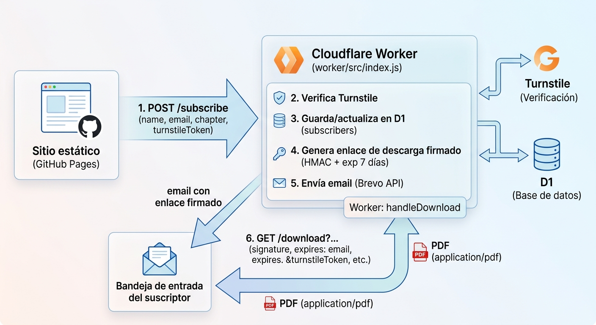

# Código Sintético — sitio y suscripción de capítulos

Sitio de **Código Sintético: El arte de orquestar agentes de IA** (Sergio
Perez Ruiz · SpecSolid Press), alojado en
[codigosintetico.specsolid.com](https://codigosintetico.specsolid.com/).
El repo contiene el sitio estático, el backend (Cloudflare Worker) que
gestiona la suscripción por correo y la entrega de capítulos en PDF, la
secuencia de seguimiento por correo, y un panel de solo lectura.

## SEO / indexación

[codigosintetico.specsolid.com](https://codigosintetico.specsolid.com/) aún
no aparece en los resultados de Google. Técnicamente el sitio ya está listo
(HTML estático, `robots.txt`, `sitemap.xml`, JSON-LD `Book` y `FAQPage`,
Open Graph completo) — lo que falta es indexación y autoridad, no código:

1. **Google Search Console**: verifica la propiedad `codigosintetico.specsolid.com`
   (mejor por DNS TXT en Cloudflare, sin tocar el HTML), envía
   `sitemap.xml` y usa "Inspeccionar URL → Solicitar indexación" en la
   página principal.
2. **Bing Webmaster Tools**: repite el mismo proceso — alimenta también a
   DuckDuckGo y Yahoo.
3. **Backlinks reales**: hoy casi no hay enlaces externos apuntando al
   sitio. Cada enlace desde un lugar de autoridad ayuda a que se indexe más
   rápido y rankee mejor: perfil de autor en Amazon, ficha en Goodreads /
   StoryGraph, bio de X/LinkedIn/GitHub, un post en Reddit o Hacker News, un
   artículo en dev.to, etc.



## Componentes

| Archivo | Rol |
|---|---|
| `index.html` / `style.css` / `app.js` | Sitio estático: hero, índice de 21 capítulos, repositorios, formulario de suscripción. |
| `admin.html` | Panel de solo lectura (Iteración 3) — protegido por admin key, no indexado. |
| `worker/src/index.js` | Todas las rutas del Worker, más el handler `scheduled` del cron. |
| `worker/src/templates.js` | HTML de los 3 correos: entrega de capítulo, seguimiento día 3, seguimiento día 7. |
| `worker/schema.sql` | Esquema de la tabla `subscribers` en D1 (instalación nueva). |
| `worker/migrations/001_add_followup_columns.sql` | Migración para bases de datos que ya existían antes de la Iteración 2. |
| `wrangler.toml` | Configuración del Worker: variables, D1, R2, Cron Trigger. |
| `CNAME` | Dominio custom para GitHub Pages (`codigosintetico.specsolid.com`). |

## Rutas del Worker

| Ruta | Método | Qué hace |
|---|---|---|
| `/subscribe` | `POST` | Verifica Turnstile, guarda/actualiza el suscriptor en D1, genera el enlace de descarga firmado y envía el correo por Brevo. |
| `/download` | `GET` | Valida la firma HMAC y la expiración (7 días) del enlace, y transmite el PDF desde R2. |
| `/unsubscribe` | `GET` | Valida la firma HMAC del enlace de baja y marca al suscriptor como `unsubscribed`. |
| `/admin/stats` | `GET` | Conteos agregados de suscriptores. Requiere header `X-Admin-Key`. |
| *(cron)* | `scheduled` | Corre diario, envía los correos de seguimiento de día 3 y día 7. |

## Los 3 capítulos gratuitos

`CHAPTER_OBJECT_KEYS` en `worker/src/index.js` mapea las 3 opciones del
formulario a los objetos reales en el bucket R2 (privado):

```js
const CHAPTER_OBJECT_KEYS = {
  cap1: "capitulo-1.pdf",   // El despertar agéntico
  cap2: "capitulo-2.pdf",   // El AI Engineer
  cap3: "capitulo-3.pdf",   // Platform Engineering en la era agéntica
};
```

El bucket ya tiene estos 3 PDFs subidos (`codigosintetico-chapters/capitulo-1.pdf`,
`capitulo-2.pdf`, `capitulo-3.pdf`) — el binding `CHAPTERS_BUCKET` del Worker
los lee directo, sin exponer el bucket como público.

## Arquitectura de la descarga

El PDF **nunca** se sirve desde una URL pública fija. El bucket R2 se queda
privado; el único lector es el propio Worker, a través del binding
`env.CHAPTERS_BUCKET`. El enlace que recibe el suscriptor apunta al propio
Worker (`/download?...`), firmado con HMAC y con expiración de 7 días
embebida — nadie puede fabricar ni reutilizar el enlace después de ese
plazo.

## Iteración 2 — secuencia de seguimiento

Un [Cron Trigger](https://developers.cloudflare.com/workers/configuration/cron-triggers/)
(`[triggers] crons = ["0 14 * * *"]` en `wrangler.toml`, una vez al día)
llama al handler `scheduled`, que:

1. Busca suscriptores activos con `created_at` de hace 3+ días y
   `day3_sent_at IS NULL` → les manda el correo de seguimiento del día 3
   (qué sigue en el libro + link a los repos) y marca `day3_sent_at`.
2. Busca suscriptores activos con `created_at` de hace 7+ días y
   `day7_sent_at IS NULL` → les manda el correo del día 7 (recordatorio +
   estado de publicación) y marca `day7_sent_at`.

Cada suscriptor recibe cada correo **como máximo una vez** (la columna
correspondiente actúa como bandera). Si alguien se da de baja entre medio,
dejan de calificar (`status = 'active'` es parte del filtro).

## Iteración 3 — panel de solo lectura

`admin.html` (no enlazado desde el nav, marcado `noindex` y bloqueado en
`robots.txt`) pide una **admin key** y llama a `GET /admin/stats` con el
header `X-Admin-Key`. Muestra: suscriptores activos, bajas, total
histórico, altas en 7/30 días, desglose por capítulo elegido, y altas por
día (últimos 14 días). No expone la lista de correos — solo conteos
agregados.

## Variables, bindings y secrets (`wrangler.toml` + `wrangler secret`)

| Nombre | Tipo | Para qué |
|---|---|---|
| `ALLOWED_ORIGIN` | var | Dominio(s) permitido(s) para CORS en `/subscribe`. |
| `SENDER_NAME` / `SENDER_EMAIL` | var | Remitente que ve el suscriptor. |
| `WORKER_ORIGIN` | var | URL pública del Worker — la usa el cron para armar el enlace de baja (ahí no hay `request` del que leer el origin). |
| `DB` | binding D1 | Tabla `subscribers`. |
| `CHAPTERS_BUCKET` | binding R2 | Bucket privado con los 3 PDFs. |
| `BREVO_API_KEY` | secret | Autenticación con Brevo. |
| `TURNSTILE_SECRET_KEY` | secret | Verifica en servidor el token de Turnstile. |
| `UNSUB_SECRET` | secret | Firma los enlaces de baja. |
| `DOWNLOAD_SECRET` | secret | Firma los enlaces de descarga — distinto de `UNSUB_SECRET`. |
| `ADMIN_KEY` | secret | Protege `/admin/stats` y `admin.html`. |

## Seguridad

- **Turnstile** descarta bots antes de tocar la base de datos.
- **Honeypot** (`website`): campo oculto que ningún humano llena.
- **Enlaces firmados con HMAC-SHA256** (descarga y baja), con expiración
  embebida en el de descarga.
- **Bucket R2 100% privado**, leído solo por el binding del Worker.
- **`/admin/stats`** requiere una key que nunca viaja en la URL (va en un
  header), y no expone correos individuales.

## Desarrollo local

```bash
npm install
cp .dev.vars.example .dev.vars   # complétalo con tus claves de prueba
npm run db:schema:local
npm run dev
```

## Despliegue

```bash
npm run deploy                   # publica el Worker (incluye el cron)
npm run db:schema:remote         # solo en instalación nueva
```

Si tu base de datos ya existía antes de esta entrega, corre la migración
en vez del schema completo:

```bash
npx wrangler d1 execute specsolid-newsletter-db --remote --file=worker/migrations/001_add_followup_columns.sql
```

El sitio estático (`index.html`, `admin.html`, `style.css`, `app.js`,
`CNAME`) se publica por separado (GitHub Pages u otro hosting estático) —
el Worker y el sitio son dos despliegues independientes.

## Roadmap

Iteraciones 1, 2 y 3 completas. Ideas para más adelante, sin urgencia:

- Botones de compra reales cuando Amazon KDP / Google Play / Lulu aprueben
  la publicación (hoy el sitio muestra "Próximamente").
- Métricas de apertura/clic de los correos, si hace falta más adelante.
- Vista previa embebida de las primeras páginas del capítulo 1, antes de
  pedir el correo.
